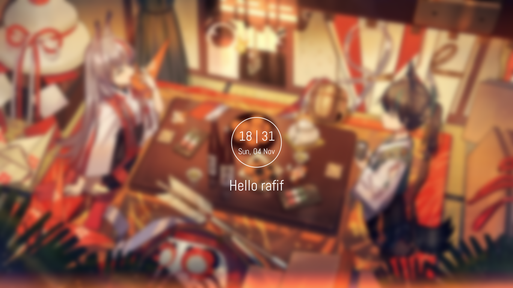
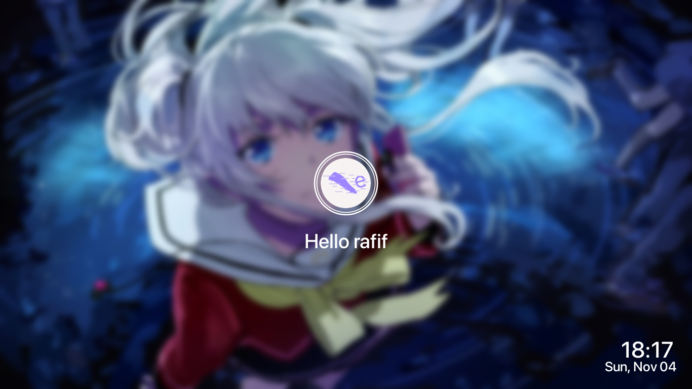

<div align="center">
	<h1>mantullockscreen</h1>
	<p>Fork from  that mantul(mantap betul)</p>
</div>

## Take a Look
### Clearlock

### User-imagelock


## Dependencies
- `bash`
- `xdotool`
- `imagemagick`
- `i3lock-color`
- [SF Pro Display Font](https://github.com/sahibjotsaggu/San-Francisco-Pro-Fonts)
- [Abel Font](https://github.com/google/fonts/tree/master/ofl/abel)
### Optional
- `compton`

## Build
1. Install the required dependencies
2. Clone this repo to your local storage
```
git clone https://github.com/ekickx/mantullockscreen
cd mantullockscreen
```
3. Run `sudo make install`

## Usage
Create cached images first with run command below <br>
`mantullockscreen -i PATH/TO/YOUR/IMAGE` <br>
After that you can run `mantullockscreen` with <br>
```
mantullockscreen -c
```
or
```
mantullockscreen -u
```
To enable slowfade effect you must use compton with fade enabled and run it with --dbus argument `compton --dbus`

